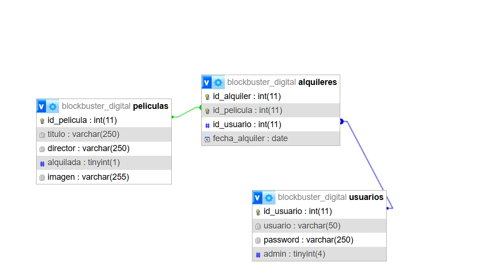

# Blockbuster Digital
## Integrantes: Maykel Tvihaug (maytvi33@email.com)

## Temática del TPE
Videoclub digital estilo Blockbuster para catalogo de alquileres de películas.

## Descripción
Sistema web que permite visualizar el catálogo de películas disponibles.
Solo el administrador puede agregar, modificar o eliminar películas del catálogo.
Los usuarios pueden explorar las películas.

## Modelo de datos
La base de datos está compuesta por tres tablas:

- **Usuarios**: almacena los datos de acceso y el rol de cada usuario (admin o cliente).
- **Películas**: contiene el catálogo con título, director.
- **Alquileres**: conecta usuarios con películas, registrando la fecha del alquiler.

Un usuario puede tener varios alquileres, pero una película solo puede estar
alquilada por un único usuario a la vez (relación 1 a N entre Usuarios y Alquileres).

Usuario Admin:
admin@blockbuster.com | admin

Usuario:
cliente@gmail.com | user

## DER
